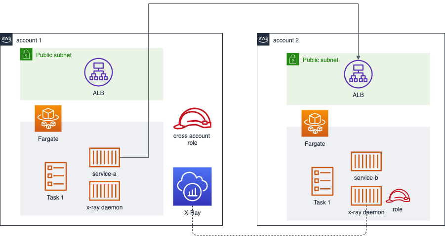

This sample demonstrate how to easily deploy two dependent services in two different AWS accounts while being monitored using X-Ray.
To facilitated deployment, Copilot utility is being used to create all the necessary infrastructure in AWS.
It creates a repository in ECR and publish a container image based on Dockerfile provided. Therefore, a ECS Fargate cluster is created and a new service is deployed using the previous image.

We will be using different environments to deploy services in different accounts and make them talk with each other.

service-a (account1) -----> service-b (account2)
environment 1                environment 2

